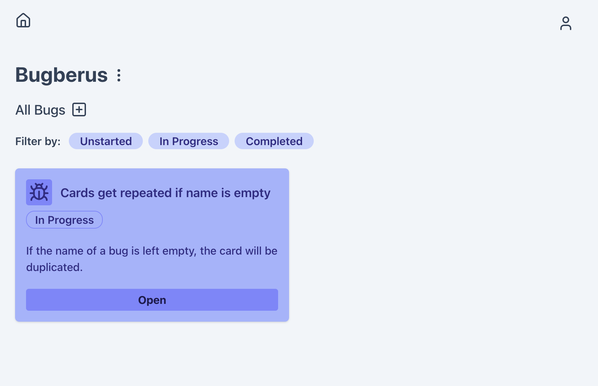

# Bugberus

Full stack bug tracking web app made with React and Node.js. The main purpose of this simple project was to get more familiarized with REST design. 

The app currently allows for
- Project and bug creation, update and deletion.
- Account sign up
- Password reset email

_For further details please look into the front or back end directories._

